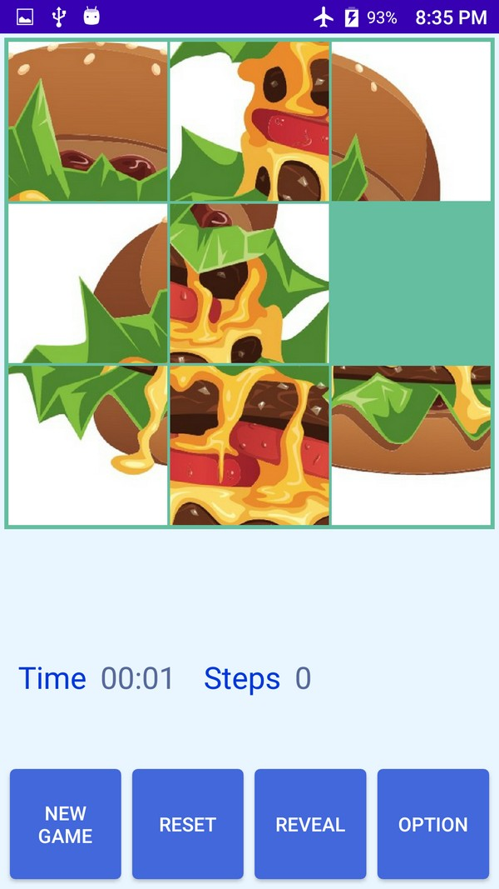
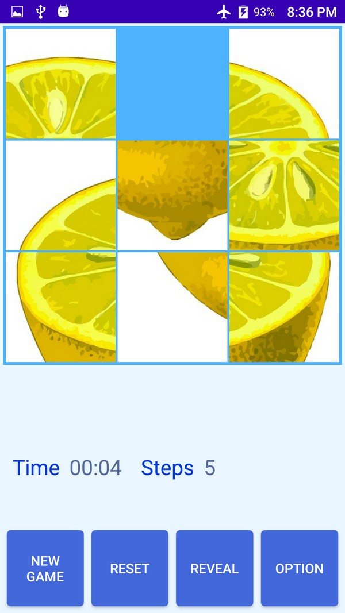
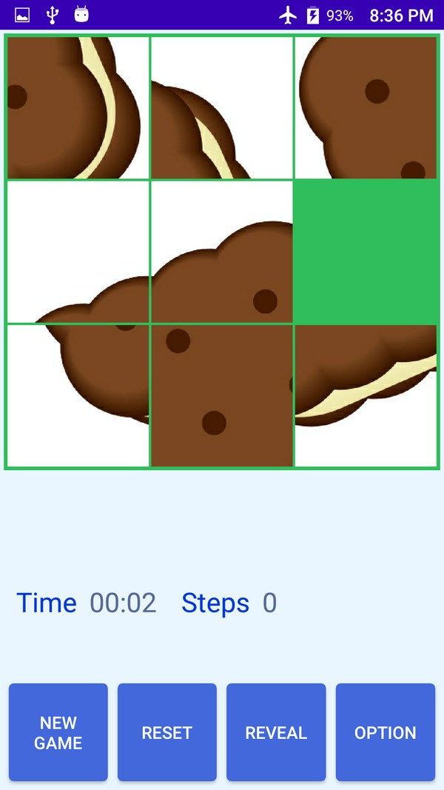
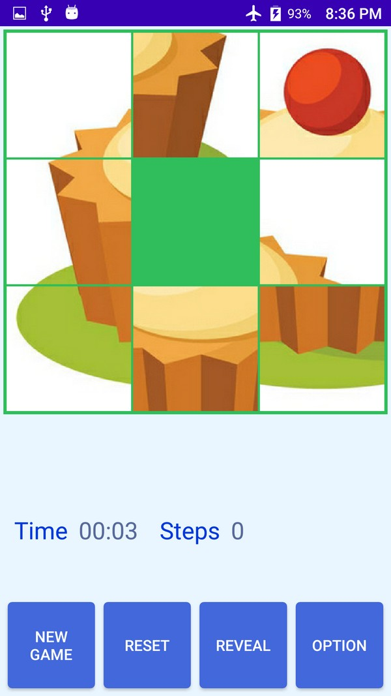

## Android-Sliding-Puzzle
Simple Sliding Puzzle for Android, This project bases on https://github.com/richardchien-archive/jigsaw-android.

## Building
Android Studio 4.1
Mininum SDK: 18
Target SDK: 30 

## Screen shot

